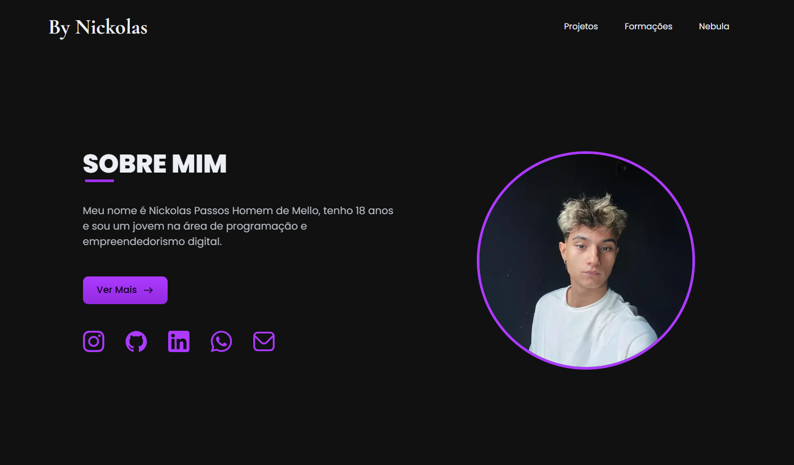
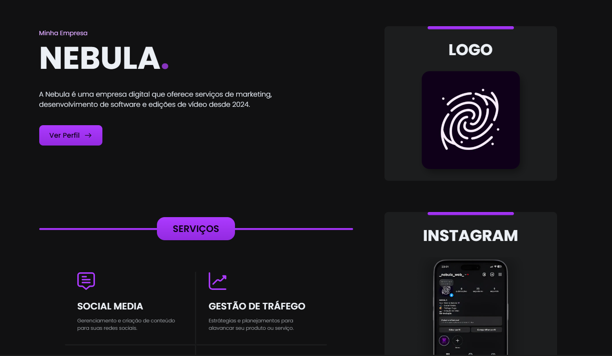

<h1 align="center" style="font-weight: bold;">Meu Portfólio 💻</h1>

<p align="center">
 <a href="#deploy">Rodar Projeto</a> • 
 <a href="#layout">Layout</a> • 
  <a href="#contato">Contato</a> •
 <a href="#licenca">Licença</a>
</p>

<p align="center">
    <b>Bem-vindo ao meu PORTFÓLIO, aqui eu reúno todos os meus projetos e conhecimentos para apresentá-lôs para vocês!</b>
</p>

<p align="center">
     <a href="https://mellonickolas.github.io/Portfolio/">➡️ VER O PORTFÓLIO ⬅️</a>
</p>

<br>

<h2 id="desenvovido"> 🏗️ Como foi desenvolvido? </h2>

<p> Para desenvolver esse projeto não foi usado nenhum tipo de framework, foram usados apenas: </p>

- **HTML :** para criar as estruturas da minha página web.
- **CSS :** para estilizar as estruturas da minha página web.
- **JAVASCRIPT :** para criar as animações.

<p>Apenas essas linguagens foram usadas, vale lembrar que tambem foi usado o <b>ESBUILD</b> para otimizar meu projeto.</p>

<br>

<h2 id="deploy"> ⏩ Rode o meu projeto! </h2>

<p> Caso você se interesse em rodar o meu projeto na sua máquina basta você usar o <b>LIVE SERVER</b>, lembrando que caso você modifique o <br>CSS</b> ou o <b>JAVASCRIPT</b> será necessário a mudança no links de importação! <br><br> Caso queira usar o <b>ESBUILD</b> basta rodar os seguintes comandos:</p>

```bash
  npm install esbuild --save-dev
```
<p>Para realizar a instalação do esbuild, depois é so rodar o arquivo com a configuração: </p>

```bash
  node js/build.js
```

<br>

<h2 id="layout">🖥️ Layout</h2>

<p align="center">
    
    
</p>

<br>

<h2 id="contato">📩 Contato</h2>
<p>
- 📧 Email: nickolasphmello10@gmail.com <br>
- 🌐 LinkedIn: www.linkedin.com/in/nickolasmello
</p>

<br>

<h2 id="licenca">📜 Licença </h2>
Este projeto está sob a licença MIT. Sinta-se à vontade para utilizá-lo como base para seu próprio portfólio! 🚀


